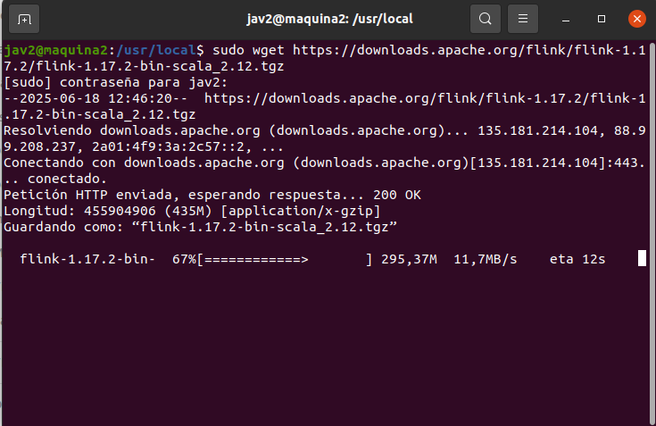
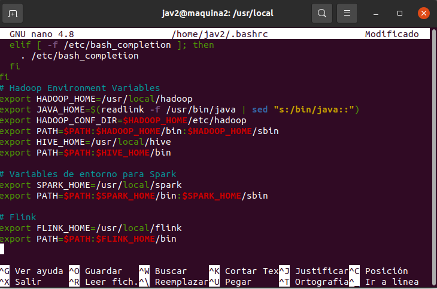
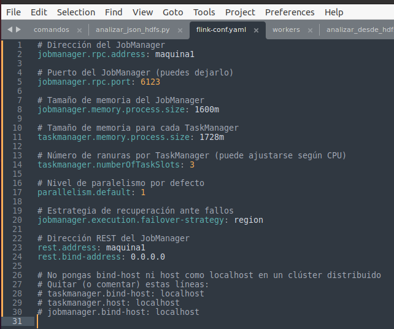
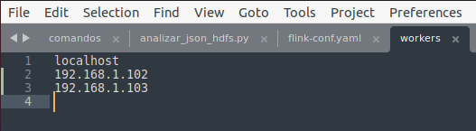
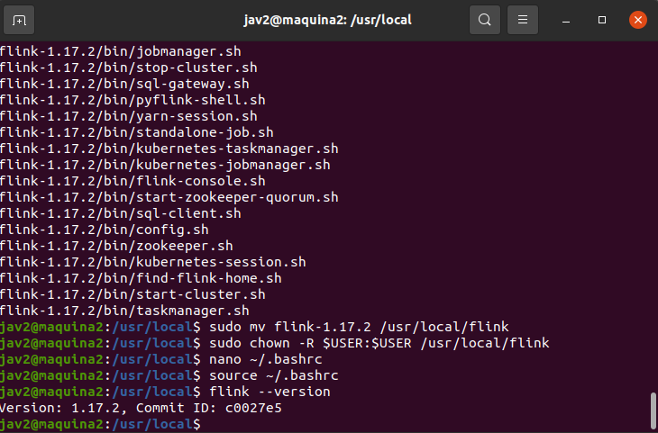
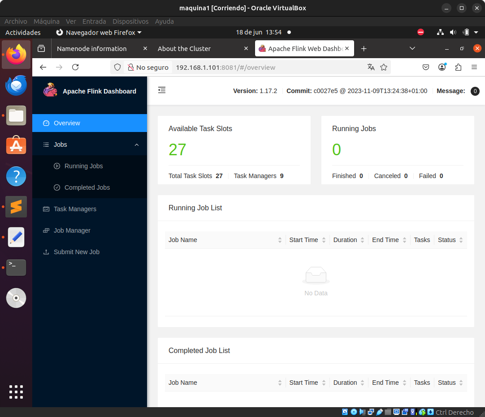

# Implementación de Apache Flink en Clúster
Este documento describe el proceso seguido para instalar y configurar Apache Flink (versión 1.17.2) en un clúster de tres máquinas virtuales con Ubuntu, distribuidas en red interna, habilitadas para ejecutar tareas distribuidas con múltiples TaskManagers y slots.

---

## 📥 Descarga e instalación de Apache Flink

Se descargó la versión 1.17.2 de Apache Flink directamente desde el sitio oficial:




```bash
wget https://downloads.apache.org/flink/flink-1.17.2/flink-1.17.2-bin-scala_2.12.tgz
```


## Configuración de variables de entorno




Se editaron las variables en el archivo .bashrc para incluir las rutas de Flink, Spark y Hadoop,
de modo que puedan ser reconocidas por el sistema desde cualquier terminal:

Ejecutar con:
```bash
export FLINK_HOME=/usr/local/flink
export PATH=$PATH:$FLINK_HOME/bin
```

## Configuración del archivo flink-conf.yaml
El archivo flink-conf.yaml fue modificado para ajustar parámetros del clúster como:

```bash
Dirección del JobManager.
Puerto RPC.
Memoria de los nodos.
Número de slots por TaskManager.
Dirección REST de comunicación.

Configuración del archivo flink-conf.yaml
El archivo flink-conf.yaml fue modificado para ajustar parámetros del clúster como:
Dirección del JobManager.
Puerto RPC.
Memoria de los nodos.
Número de slots por TaskManager.
Dirección REST de comunicación.
```



## Configuración de los nodos del clúster
Se agregaron las direcciones IP de las tres máquinas (incluido localhost) en el archivo workers para que Flink sepa dónde distribuir los TaskManagers:
```bash
localhost
192.168.1.102
192.168.1.103

```



## Verificación de instalación
Con las configuraciones listas, se utilizó el comando:
```bash
flink --version
```
Para validar que Flink está correctamente instalado y accesible.




## Estado Final del Clúster
Finalmente, se accedió al panel web de Flink desde un navegador apuntando a:
```bash
http://192.168.1.101:8081
```
Donde se pudo observar el estado del clúster distribuido correctamente.




Versión de Flink: 1.17.2
JobManager: Activo
TaskManagers: 9
Total Task Slots: 27
Esto confirma que el clúster está ejecutando correctamente Flink en múltiples nodos, con capacidad para tareas distribuidas en paralelo.
