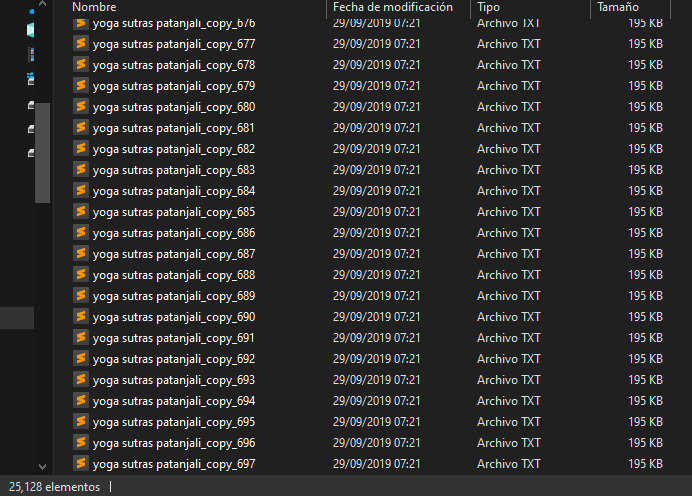
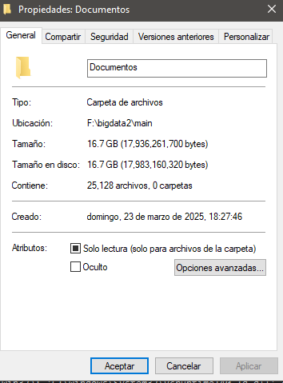
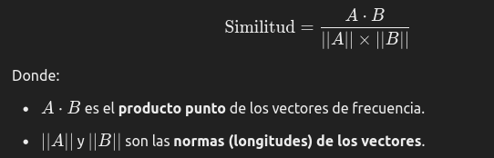
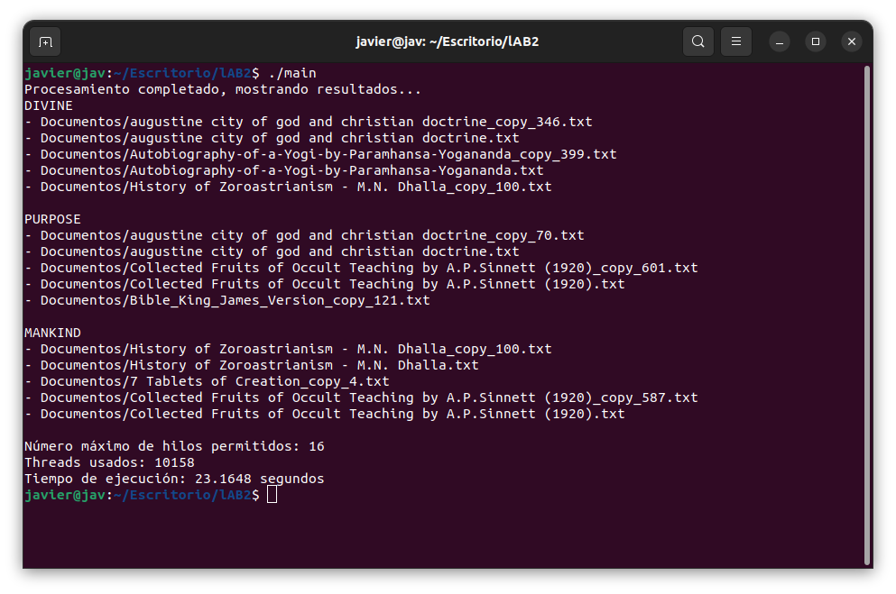

## Big-data
El codigo del archivo ***GeneradorDocumentos*** es un scrip para copiar los archivos que usaremos para la tarea de Índice Invertido
estos archivos an sido extraidos de ***https://www.kaggle.com/datasets/metron/public-files-of-religious-and-spiritual-texts?resource=download***

la cantidad de elementos que me genero fue de:

y el peso final que me genero tras 697 copias es de:

para la clasificacion de elementos para nuestro index usaremos la similitud coseno cuya formula es  

El programa encuentra el documento más cercano calculando la similitud coseno entre vectores de frecuencia. Funciona utilizando la idea de los búferes por thread, donde cada hilo procesa un documento. Dado que ahora el problema no es el peso sino la cantidad de elementos, cambiamos de metodología y obtenemos los siguientes resultados.

