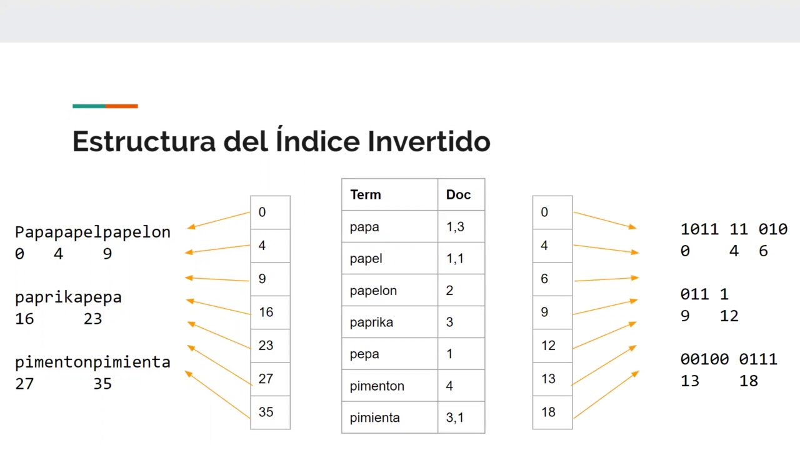

## Big-data
El codigo del archivo ***GeneradorDocumentos*** es un scrip para copiar los archivos que usaremos para la tarea de Índice Invertido

la cantidad de elementos que me genero fue de:

y el peso final que me genero tras 697 copias es de:
