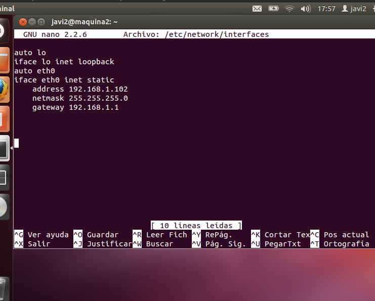
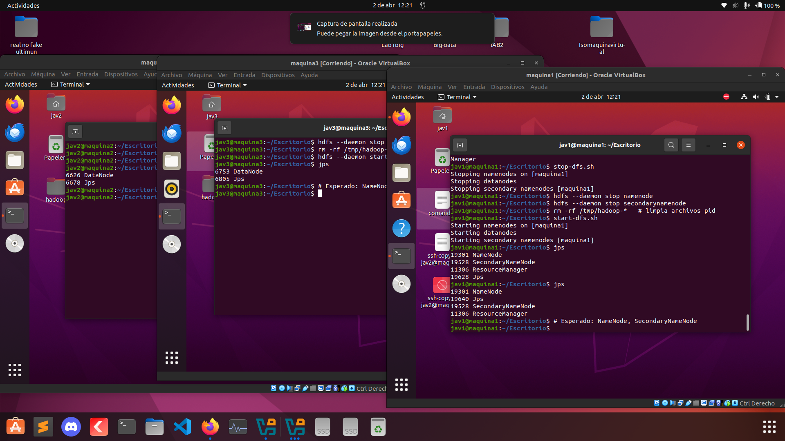

# Configuración de un Clúster de Hadoop en VirtualBox

Este documento detalla los pasos para configurar un clúster de Hadoop en VirtualBox con tres máquinas virtuales (VMs) ejecutando Ubuntu 12.04.

## Requisitos Previos
- VirtualBox instalado en tu sistema.
- Archivo ISO de Ubuntu 12.04.
- Al menos 32 GB de RAM y 80 GB de espacio libre en disco.

## Creación de las Máquinas Virtuales
### 1. Crear las 3 VMs en VirtualBox
1. Abre VirtualBox y haz clic en **Nueva**.
2. Asigna un nombre a la máquina, por ejemplo, `maquina1`.
3. Selecciona **Linux** y versión **Ubuntu (64-bit)**.
4. Asigna **4 GB de RAM** a cada máquina.
5. Crea un disco duro virtual (dinámico, mínimo 20 GB).
6. Repite estos pasos para `maquina2` y `maquina3`.


## Instalación de Ubuntu 12.04 en cada VM
1. Inicia cada VM con la ISO de Ubuntu 12.04.
2. Sigue los pasos de instalación estándar.
3. Crea un usuario con permisos de administrador.
4. Actualiza los paquetes:
   ```bash
   sudo apt-get update && sudo apt-get upgrade -y
   ```

## Configuración de Red
### 1. Cambiar la configuración de red en VirtualBox
1. Apaga las máquinas virtuales.
2. Ve a **Configuración > Red** de cada VM.
3. En el **Adaptador 1**, selecciona **Red interna** y pon el nombre `hadoop-net`.
4. Asegúrate de que la opción **Cable conectado** esté activada.


### 2. Configurar direcciones IP estáticas
1. Edita el archivo de configuración de red en cada máquina:
   ```bash
   sudo nano /etc/network/interfaces
   ```
2. Agrega la siguiente configuración (ajustando la IP de cada VM):
   ```bash
   auto eth0
   iface eth0 inet static
   address 192.168.1.101  # Cambiar para cada VM (102, 103)
   netmask 255.255.255.0
   gateway 192.168.1.1
   ```
3. Guarda y reinicia la red:
   ```bash
   sudo systemctl restart networking
   ```



### 3. Verificar la configuración de red
Ejecuta el siguiente comando en cada VM para verificar la IP asignada:
```bash
ip a
```


## Comprobar Conectividad entre las Máquinas
Ejecuta un ping desde cada máquina a las demás:
```bash
ping -c 4 192.168.1.102  # Desde maquina1 a maquina2
ping -c 4 192.168.1.103  # Desde maquina1 a maquina3
ping -c 4 192.168.1.101  # Desde maquina2 a maquina1
```


Si el ping es exitoso, la configuración de red está completa. 🚀
para instalar hadoop se a tenido un problema con la vercion de maquina virtual no se puso instalar java asi que se cambio a a vercion 22 de ubuntu y siguiendo los mismos pasos nos queda de esta manera el cluster:

