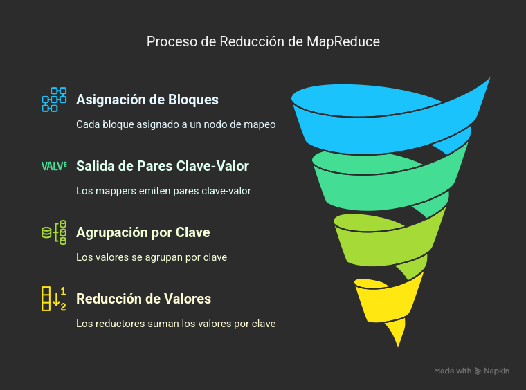
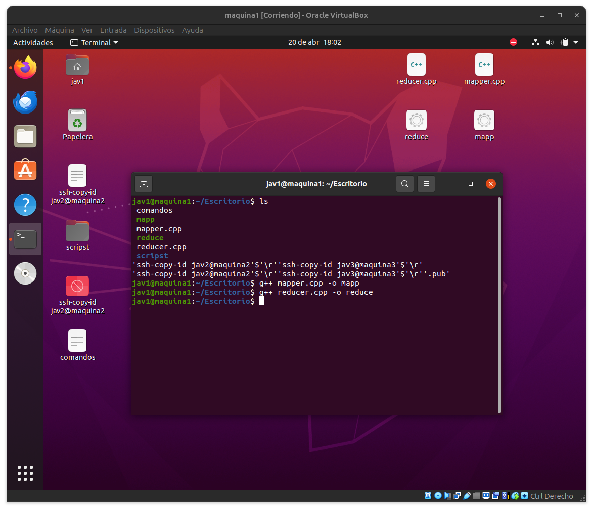
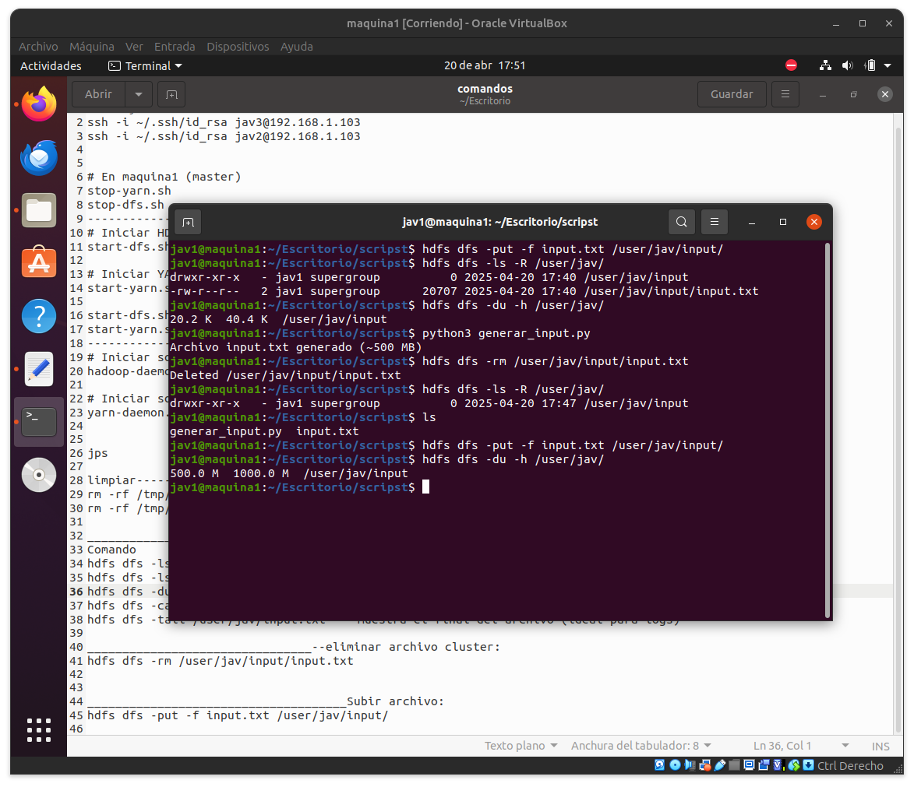
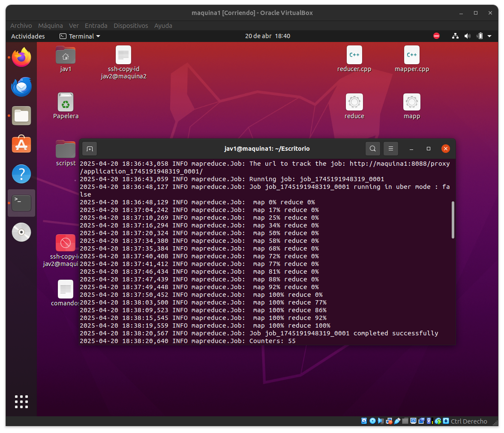
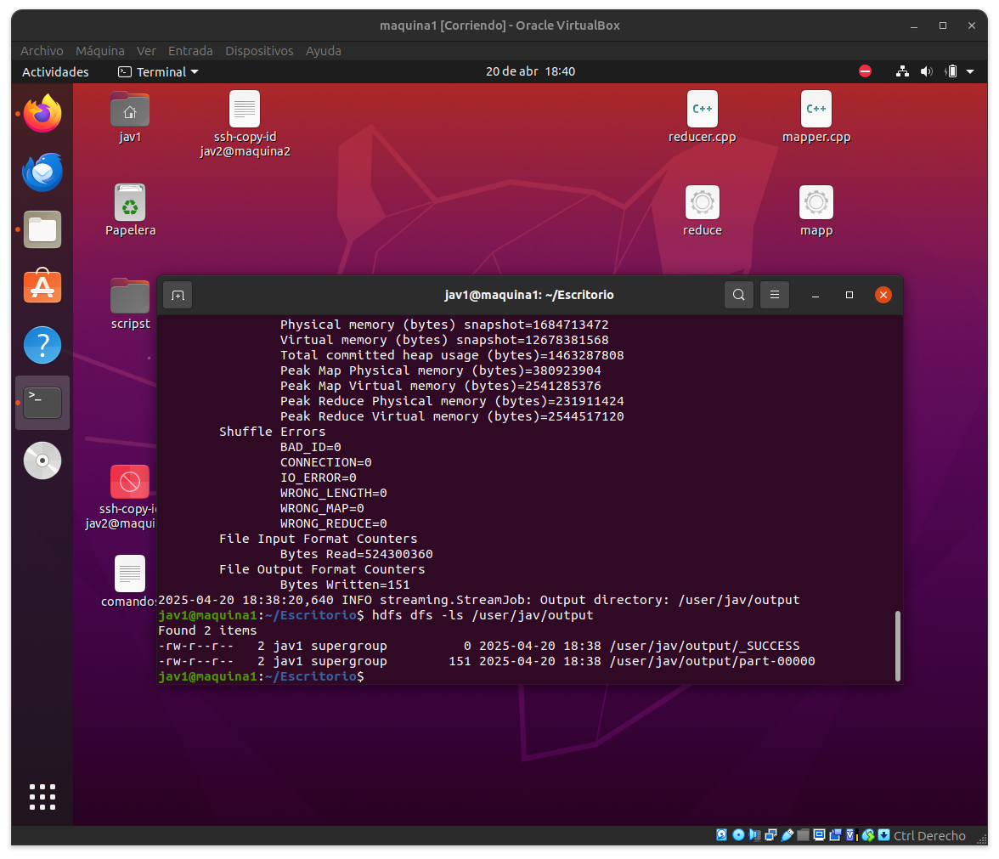
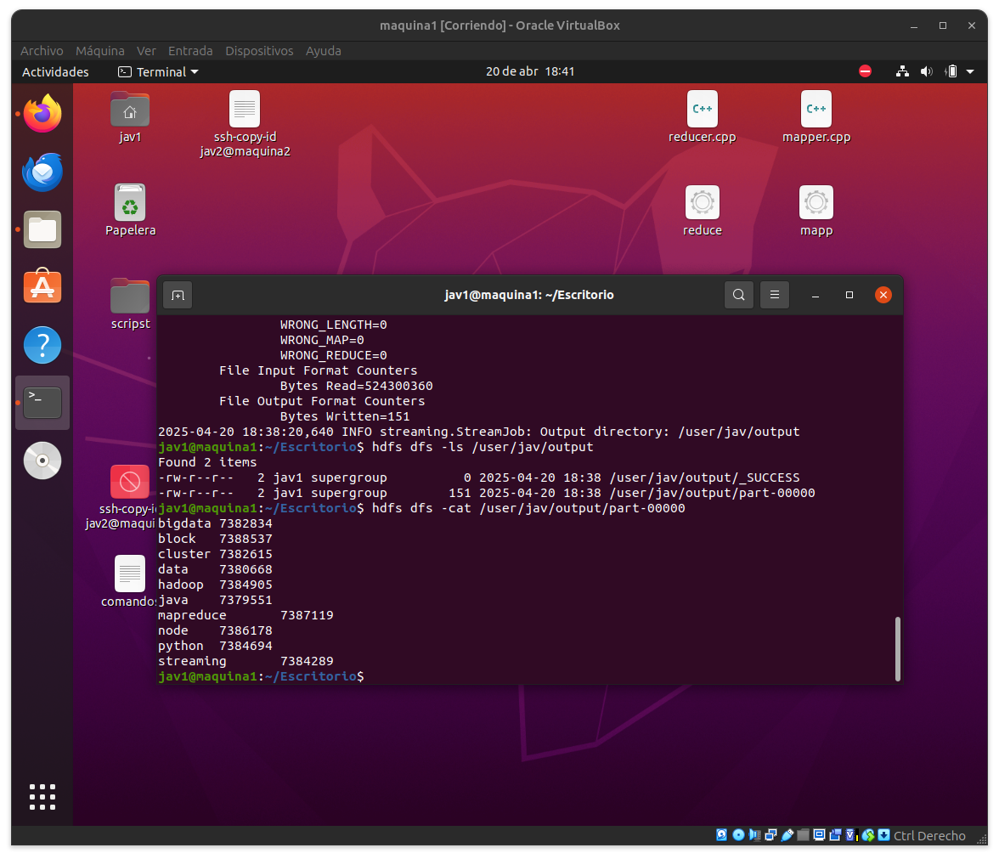
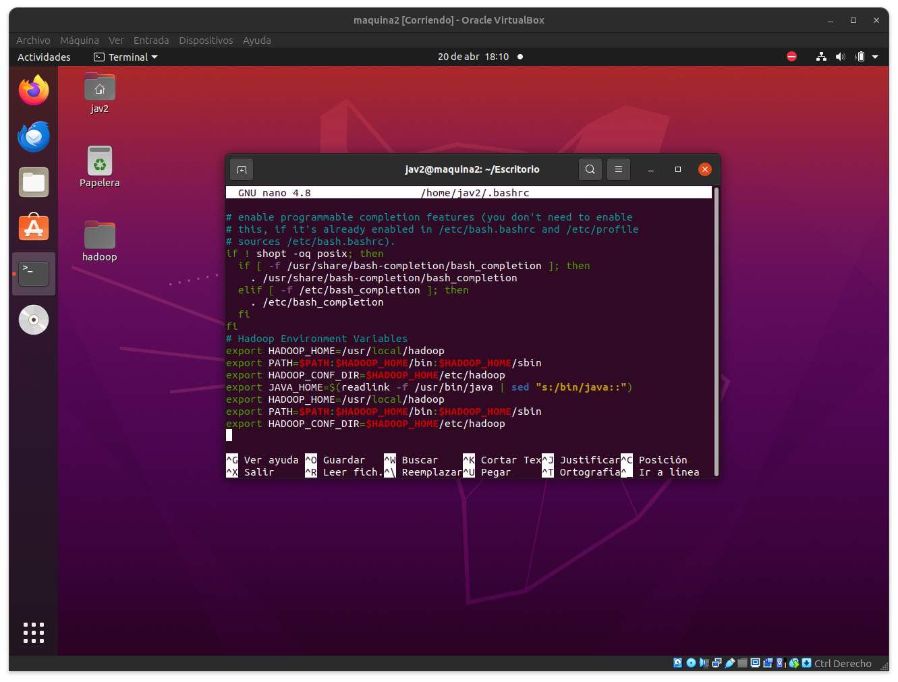
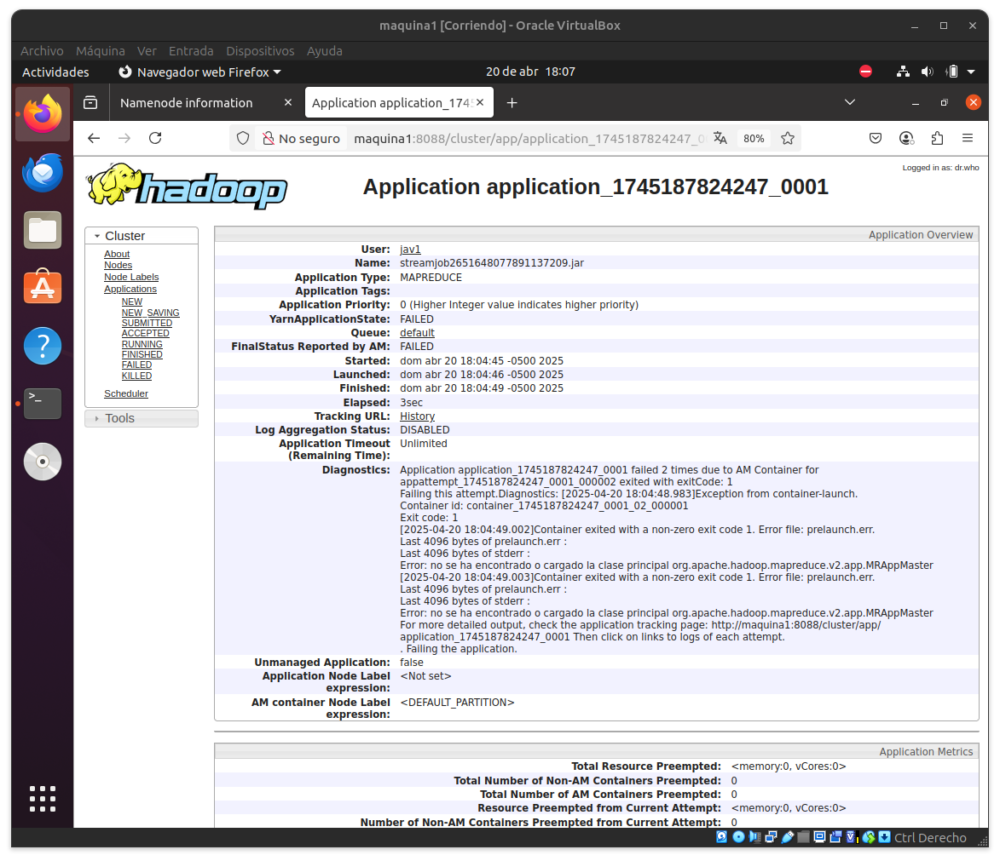
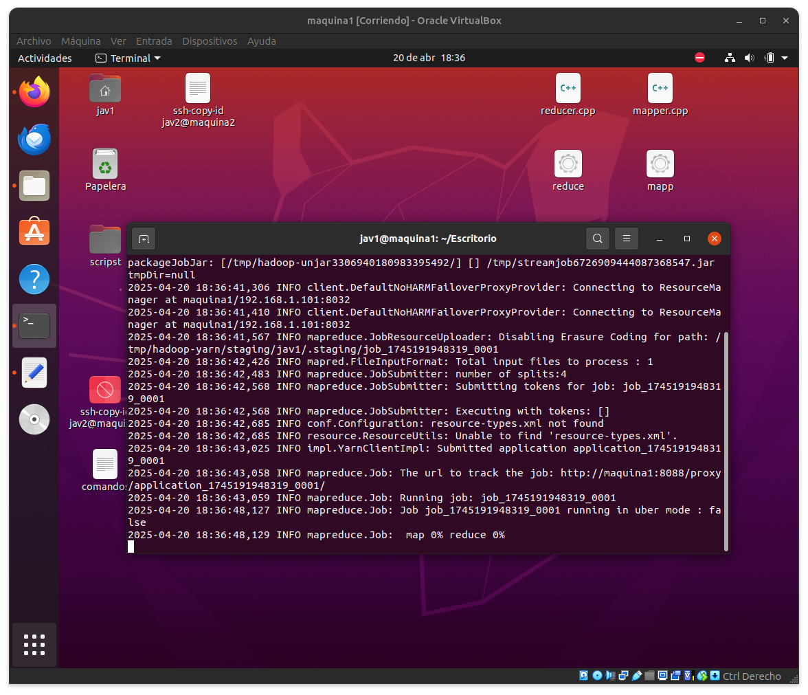

# Word Count

Este documento detalla el flujo completo para ejecutar un programa MapReduce en un clúster Hadoop sobre VirtualBox, utilizando código propio en C++ y Python para contar palabras desde un archivo grande cargado a HDFS.

## Explicación del Proceso de MapReduce



La imagen representa de manera gráfica cómo funciona internamente el proceso de MapReduce.
Primero, cuando se sube un archivo como input.txt al HDFS, aunque este sea de tamaño pequeño (como 20 KB), el sistema lo trata igual que a uno grande, dividiéndolo en bloques.

Después, Hadoop divide esos bloques en unidades más pequeñas llamadas splits lógicas, que no dependen del tamaño físico, sino de las líneas o registros. Cada split es procesado por un Mapper.

## Explicación del Proceso de MapReduce



En esta etapa se preparan los componentes esenciales para ejecutar MapReduce:
1. mapper.cpp: código que define la lógica de mapeo.
2. reducer.cpp: define la lógica de reducción.
3. generar_input.py: script que genera un archivo de texto grande para pruebas.
Los archivos .cpp fueron compilados con g++ para obtener los ejecutables mapp y reduce, que serán usados en el clúster.



Posteriormente, se utilizó el script Python para crear un archivo input.txt de aproximadamente 500 MB, simulando un volumen realista de datos. Este archivo fue cargado a HDFS y automáticamente dividido en bloques, distribuyéndose en los nodos del clúster.

## Ejecución del Trabajo y Resultados del Word Count
Una vez cargado el archivo al HDFS y listos los ejecutables, se lanzó el trabajo MapReduce utilizando hadoop jar en modo streaming.



En TrabajoCompleto.png, se observa la ejecución del trabajo, donde los logs muestran el avance de las tareas de mapeo y reducción, ambas alcanzando el 100%.



En clusterTerminado1.png, desde la interfaz web de YARN se confirma que la ejecución del job ha finalizado correctamente.



Finalmente, en WordCount.png se visualizan los resultados del Word Count. Este resultado se almacena en un archivo part-00000 en el HDFS y contiene la cantidad de veces que cada palabra aparece en el dataset.

## Errores Encontrados y Solución Aplicada



Durante el desarrollo, se presentó un error al lanzar el trabajo. La causa estaba relacionada con variables de entorno mal configuradas, lo cual impidió que Hadoop encontrara correctamente sus directorios.



Esto fue detectado al revisar los diagnósticos detallados desde la interfaz web (ErrorEncontrado.png), y se solucionó modificando el archivo ~/.bashrc para agregar las siguientes variables:
```bash
export HADOOP_HOME=/usr/local/hadoop
export PATH=$PATH:$HADOOP_HOME/bin:$HADOOP_HOME/sbin
export HADOOP_CONF_DIR=$HADOOP_HOME/etc/hadoop
```
Después de agregar estas líneas, se ejecutó el siguiente comando para aplicar los cambios:

```bash
source ~/.bashrc
```


Finalmente, se recompilaron los ejecutables (VolveraCompilar.png) y el trabajo se pudo lanzar y completar correctamente.
