# Configuración de Apache Hive

Este proyecto contiene los pasos necesarios para configurar Apache Hive 3.1.3 sobre un entorno con Hadoop. Asegúrate de seguir los pasos con precisión para que el sistema funcione correctamente.

## Paso 1: Descarga e instalación de Hive
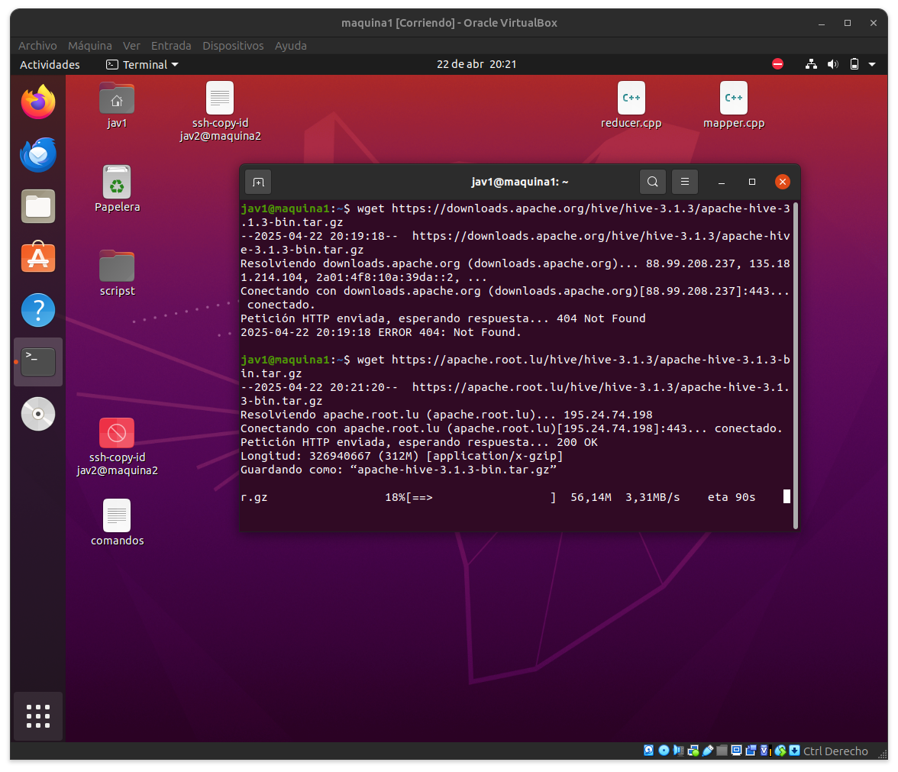
Descarga la versión correspondiente desde el repositorio oficial de Apache y muévela al directorio deseado.

```bash
wget https://apache.root.lu/hive/hive-3.1.3/apache-hive-3.1.3-bin.tar.gz
sudo mv apache-hive-3.1.3-bin /usr/local/hive
```
## Paso 2: Configuración de variables de entorno
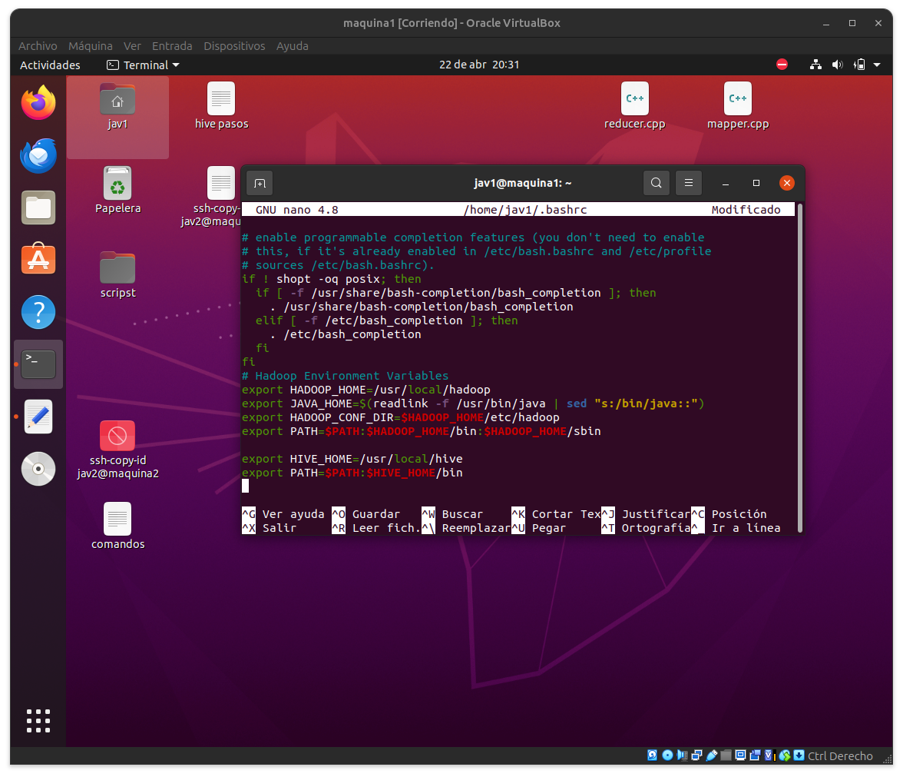

Edita el archivo .bashrc para agregar las rutas necesarias para Hive.
```bash
nano ~/.bashrc
```
Agrega las siguientes líneas al final del archivo:

```bash
export HIVE_HOME=/usr/local/hive
export PATH=$PATH:$HIVE_HOME/bin
```
Aplica los cambios con:

```bash
source ~/.bashrc
```
## Paso 3: Configuración de Hive

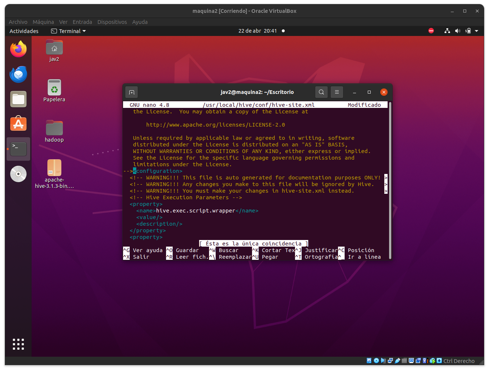

Edita el archivo de configuración principal de Hive:
```bash
nano $HIVE_HOME/conf/hive-site.xml
```
Asegúrate de que la configuración contenga lo siguiente:

```bash
<property>
  <name>javax.jdo.option.ConnectionURL</name>
  <value>jdbc:derby:;databaseName=metastore_db;create=true</value>
  <description>URL de conexión para la base de datos metastore Derby</description>
</property>

<property>
  <name>javax.jdo.option.ConnectionDriverName</name>
  <value>org.apache.derby.jdbc.EmbeddedDriver</value>
</property>

<property>
  <name>javax.jdo.option.ConnectionUserName</name>
  <value>hive</value>
</property>

<property>
  <name>javax.jdo.option.ConnectionPassword</name>
  <value>hive</value>
</property>

<property>
  <name>hive.exec.local.scratchdir</name>
  <value>/tmp/hive</value>
</property>

<property>
  <name>hive.metastore.warehouse.dir</name>
  <value>/user/hive/warehouse</value>
</property>

<property>
  <name>datanucleus.schema.autoCreateAll</name>
  <value>true</value>
</property>
```
## Paso 4: Preparación del HDFS

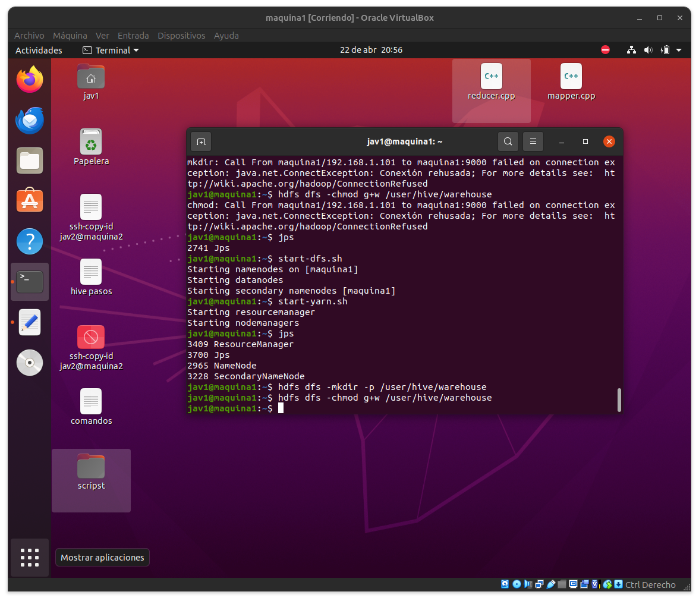

Importante: Verifica que Hadoop esté en funcionamiento antes de continuar.
Crea los directorios necesarios dentro del sistema de archivos distribuido y ajusta los permisos.
## Paso 5: Inicialización del esquema de Hive
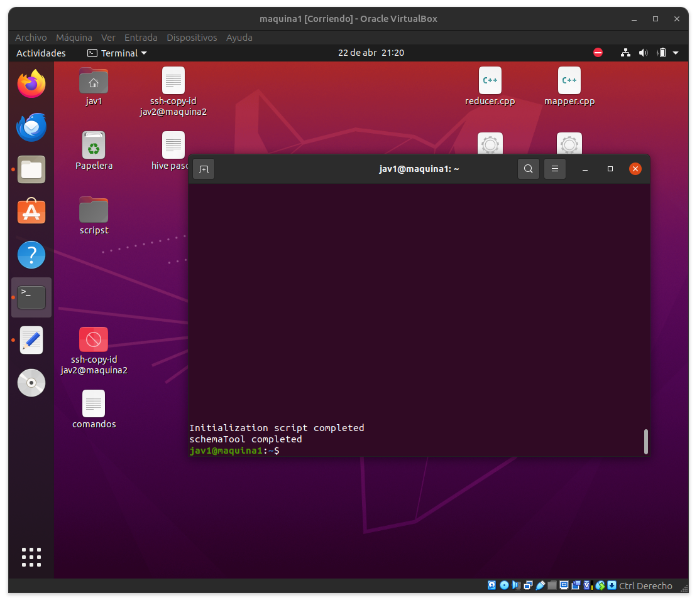

Este paso se realiza solo en la máquina principal.
```bash
schematool -dbType derby -initSchema
```
## Paso 6: Corrección de configuración
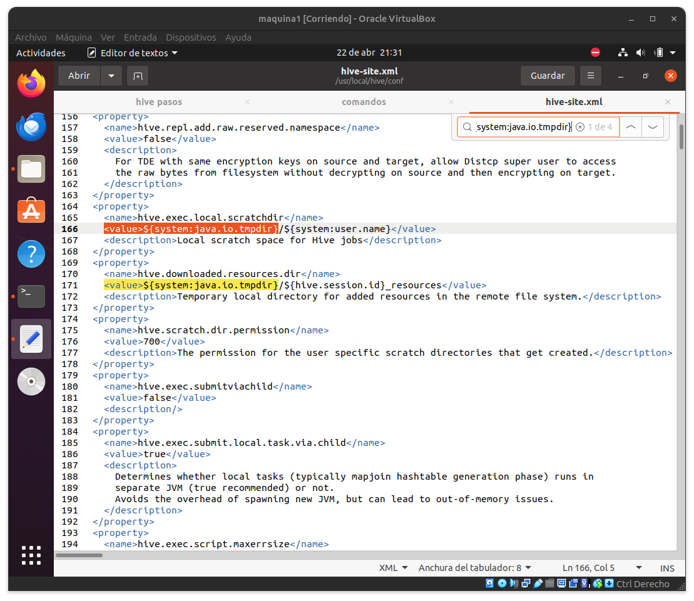

En el archivo hive-site.xml, en la línea 3238, puede haber un error tipográfico. Asegúrate de reemplazar el texto por:
```bash
Ensures commands with OVERWRITE (such as INSERT OVERWRITE) acquire Exclusive locks for transactional tables.
```
## Iniciar Hive
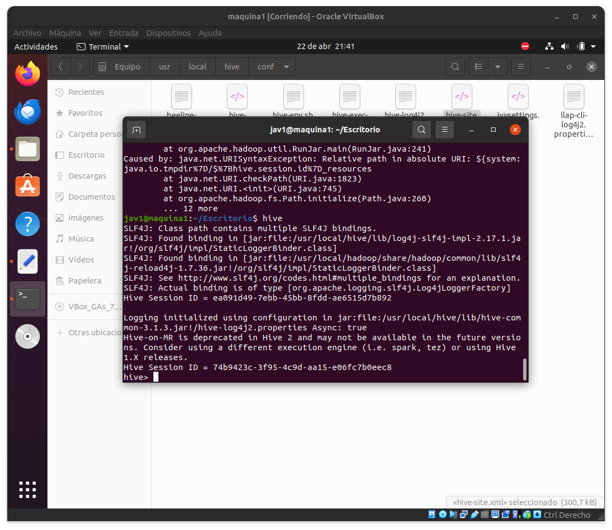

Finalmente, inicia la consola interactiva de Hive con:

```bash
hive
```

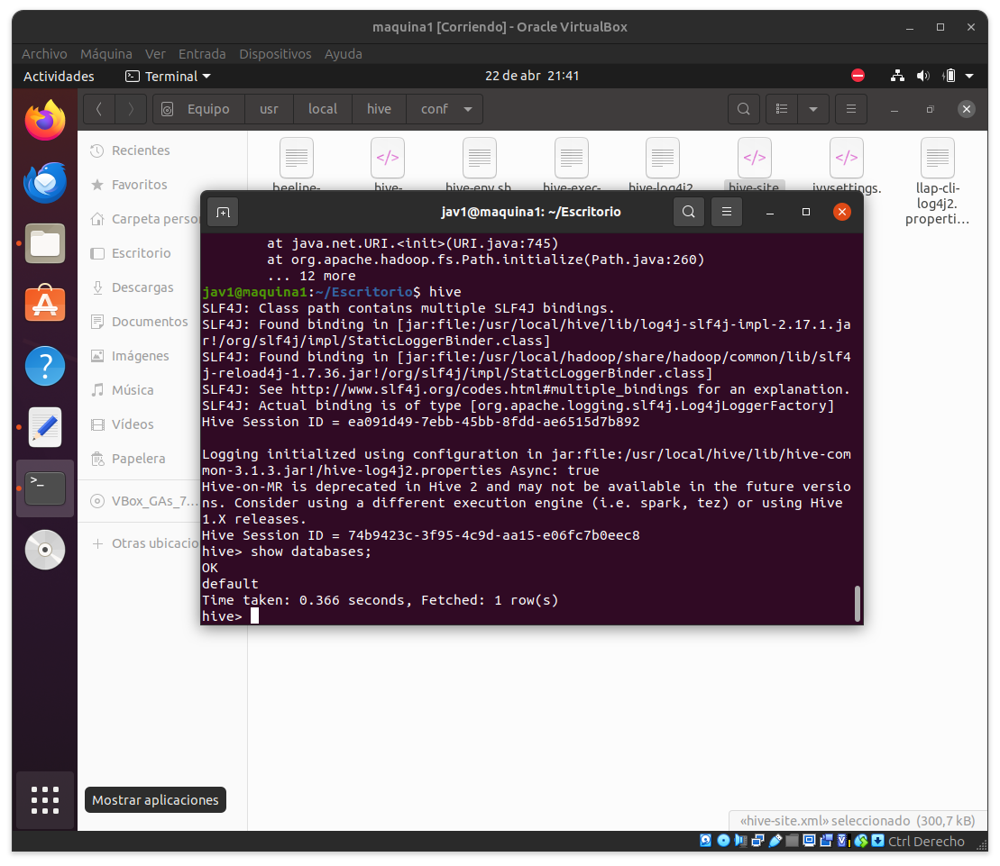

Puedes probar la instalación listando las bases de datos:

```bash
show databases;
```

## Paso 6: WordCount 

### Paso 1: Generar y subir database
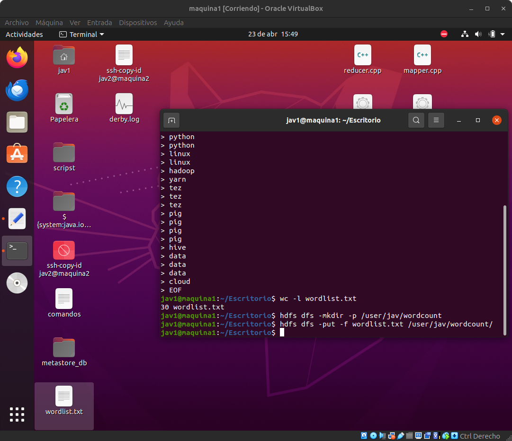

Generar y subir un txt a HDFS para crear la tabla en hive
### Paso 2: Crear la tabla externa en Hive
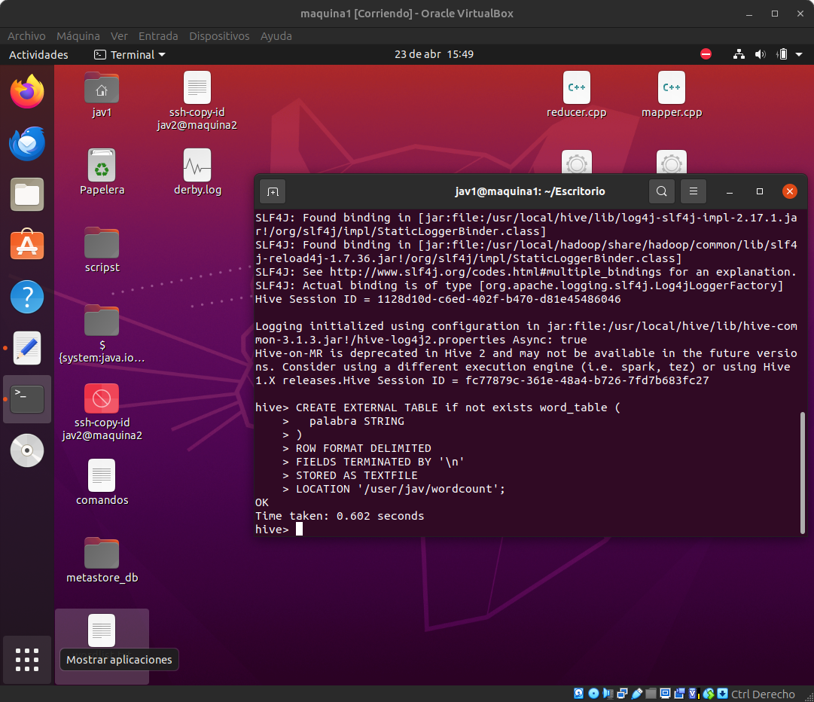

```bash
CREATE EXTERNAL TABLE if not exists word_table (
  palabra STRING
)
ROW FORMAT DELIMITED
FIELDS TERMINATED BY '\n'
STORED AS TEXTFILE
LOCATION '/user/jav/wordcount';
```
Es una tabla externa, lo que significa que Hive no borra los datos de HDFS al eliminarla.
Hive leerá directamente desde HDFS en /user/jav/wordcount.
### Paso 3: Contar las palabras (WordCount)

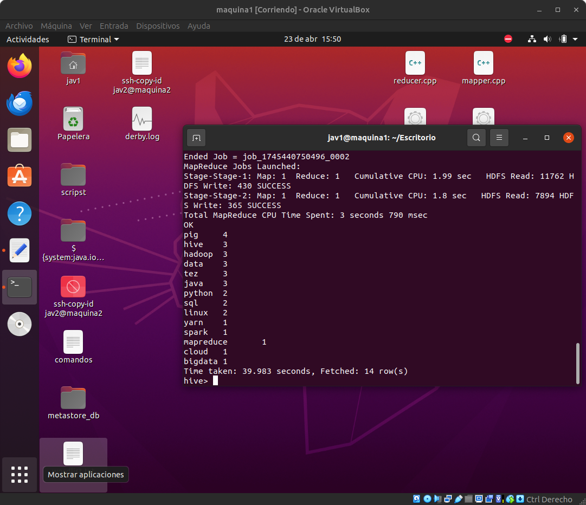
Colocar este comando para buscar en la tabla la cantidad de palabras repetidas
```bash
SELECT palabra, COUNT(*) as total
FROM word_table
GROUP BY palabra
ORDER BY total DESC;
```