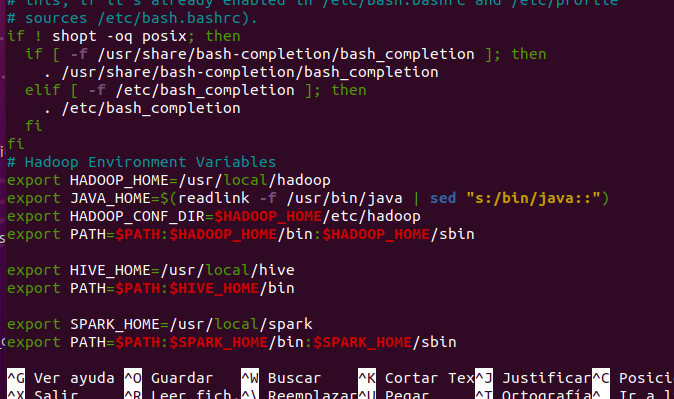
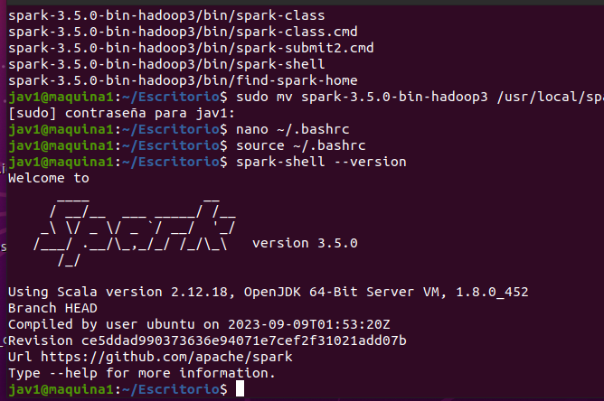
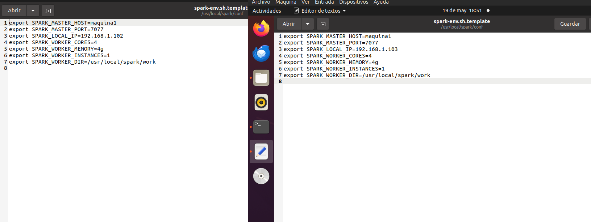
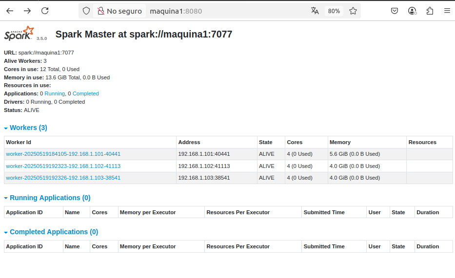
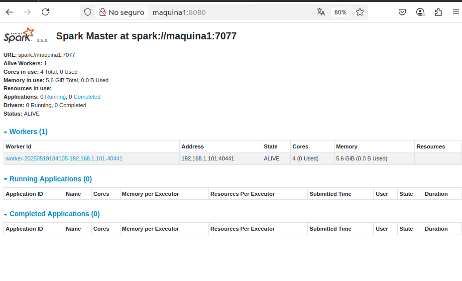

# Instalación De spark Local 

## Paso 1: Descarga e instalación de SPARK
Se deve descargar, extraer y mover la carpeta SPARK
```bash
wget https://archive.apache.org/dist/spark/spark-3.5.0/spark-3.5.0-bin-hadoop3.tgz
tar -xvzf spark-3.5.0-bin-hadoop3.tgz
sudo mv spark-3.5.0-bin-hadoop3 /usr/local/spark
```
## Paso 2: Configuración de variables de entorno

Abrir el archivo ~/.bashrc y añade las lineas 




Luego, aplica los cambios con:
```bash
source ~/.bashrc
```
modificar el archivo workes:
```bash
nano /usr/local/spark/conf/workers

añadir los ips corespondientes ejem:
192.168.1.102
192.168.1.103
```
finalmente para ver si se instalo el framework colocar :
```bash
spark-shell --version
```
deve salir la siguiente imagen


aser estos pasos en los nodos esclavos
## Paso 3: Configuración archivo de Spark
Crear este archivo:
```bash
nano /usr/local/spark/conf/spark-env.sh
```
luego modificar cada maquina segun su nombre y estadisticas que tiene ejem:
```bash
export SPARK_MASTER_HOST=maquina1
export SPARK_MASTER_PORT=7077
export SPARK_LOCAL_IP=<IP_del_nodo>
export SPARK_WORKER_CORES=4
export SPARK_WORKER_MEMORY=4g
export SPARK_WORKER_INSTANCES=1
export SPARK_WORKER_DIR=/usr/local/spark/work
```
en mi caso este seria mis nodos esclavos:




aser esto en todos los nodos incluido el host

## Paso 4: Resultado Final:




posteriormente revisar en la pagina http://maquina1:8080 para verificar que esten funcionando los worked
para inicializar usar estos pasos:
```bash
stop-all.sh
start-master.sh
start-slave.sh spark://maquina1:7077

```

## Paso 5: Problemas encontrados





en caso que no reconosca los nodos spark verificar el archivo nano /usr/local/spark/conf/workers no usar nombres usar ips
