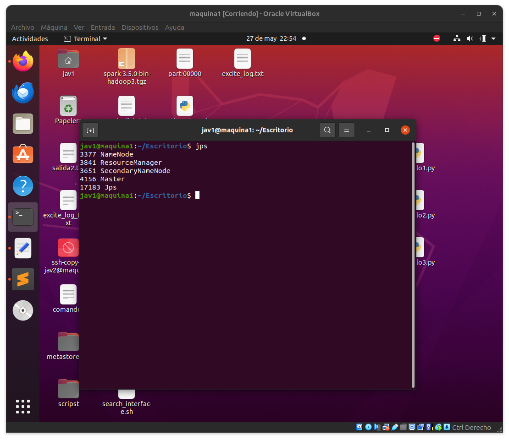
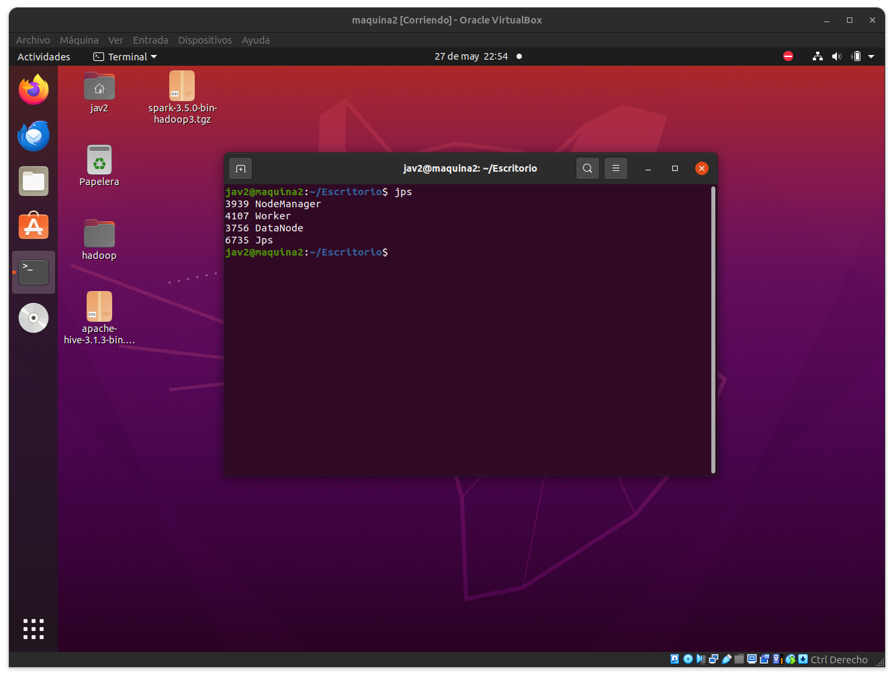
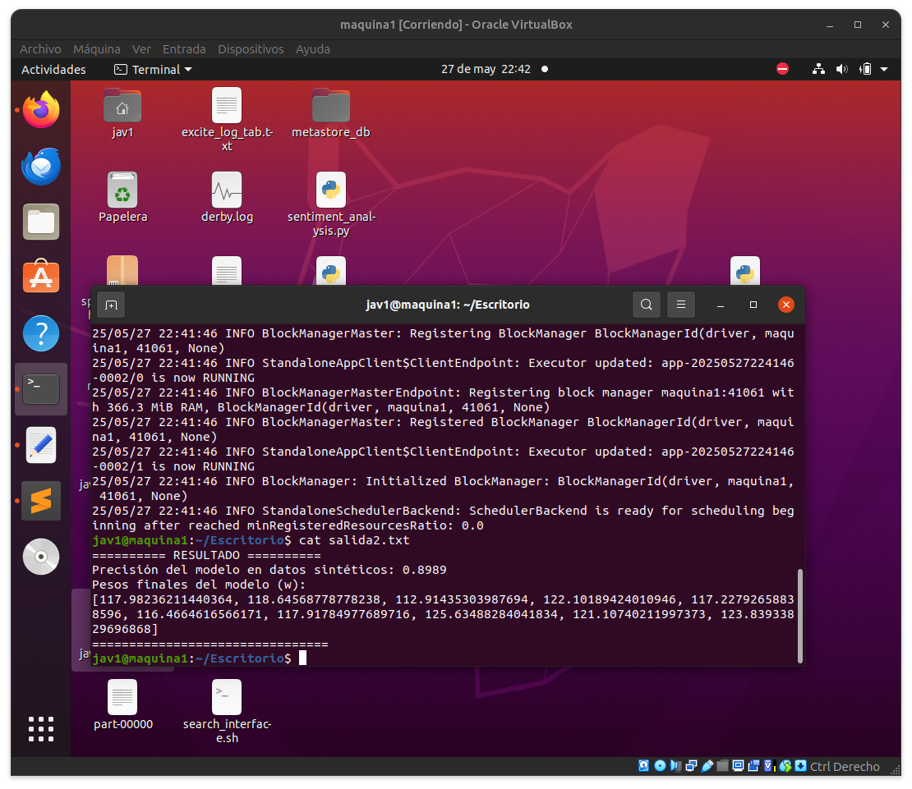
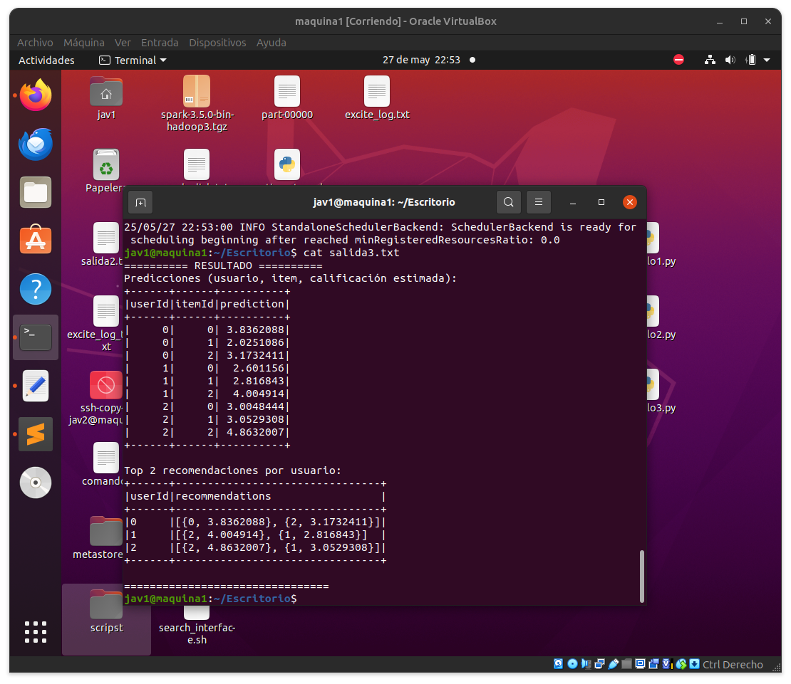

# Implementacion local de Ejemplos del paper Spark: Cluster Computing with Working Sets

## Paso 1:activar el cluster y Spark

usar este comando
```bash
jps
```

maquina principal:



maquinas secundarias:




## Paso 2: buscador de palabras
Buscamos cuántas líneas del texto de Moby Dick contienen una palabra dada, usando RDD.
| Comando | Descripción |
|--------|-------------|
| `sc.textFile(path)` | Crea un RDD a partir de un archivo de texto. Cada línea es un elemento del RDD. |
| `rdd.filter(func)` | Filtra los elementos del RDD que cumplen la condición dada por `func`. |
| `rdd.count()` | Cuenta el número de elementos del RDD (acción que ejecuta el DAG). |
| `rdd.take(n)` | Recupera los primeros `n` elementos del RDD. Útil para mostrar ejemplos. |

🧠 ¿Por qué usar filter?
Porque queremos reducir el conjunto original y quedarnos solo con líneas que cumplan una condición, en este caso que contengan "whale". Esto no ejecuta nada aún, Spark espera hasta que le pidas un count() o take() para distribuir el trabajo.

Ejecutar con:
```bash
spark-submit --master spark://maquina1:7077 Ejemplo1.py > salida.txt
```
el codigo da como resultado:


## Paso 3: Regresión logística con RDDs
Entrenamos un modelo de regresión logística de forma manual, distribuyendo el cálculo del gradiente sobre RDDs.
| Comando | Descripción |
|--------|-------------|
| `sc.parallelize(data)` | Crea un RDD a partir de una colección local (lista de Python). |
| `rdd.cache()` | Guarda el RDD en memoria distribuida para acelerar múltiples accesos. |
| `rdd.foreach(func)` | Aplica una función a cada elemento del RDD (acción, se ejecuta en paralelo). |
| `rdd.map(func)` | Transforma cada elemento del RDD usando una función `func`. |
| `rdd.mean()` | Calcula el promedio de los elementos del RDD (requiere datos numéricos). |
| `Accumulator` | Objeto compartido que permite acumular valores en operaciones paralelas (como sumar gradientes). |

RDDs permiten distribuir los datos y operaciones sin usar estructuras complejas.
Acumuladores permiten acumular resultados (como vectores de gradiente) en paralelo de forma segura.

Ejecutar con:
```bash
spark-submit Ejemplo2.py > salida2.txt

---salida---
cat salida2.txt
```
el codigo da como resultado:




## Paso 4: ALS 
Creamos un sistema de recomendación basado en la técnica ALS (factorización de matrices).
| Comando | Descripción |
|--------|-------------|
| `spark.createDataFrame(data)` | Crea un DataFrame a partir de una lista de objetos `Row` o diccionarios. |
| `ALS()` | Crea un modelo de recomendación basado en Alternating Least Squares (ALS). |
| `als.fit(df)` | Entrena el modelo ALS usando el DataFrame `df`. |
| `model.transform(df)` | Genera predicciones para combinaciones usuario-producto. |
| `df1.crossJoin(df2)` | Genera el producto cartesiano entre dos DataFrames (todos los pares posibles). |
| `model.recommendForAllUsers(k)` | Genera las `k` mejores recomendaciones por usuario. |
| `df.show()` | Muestra el contenido del DataFrame en la consola. |
Ejecutar con:
```bash
spark-submit Ejemplo3.py > salida3.txt
---salida---
cat salida3.txt

```
el codigo da como resultado:



